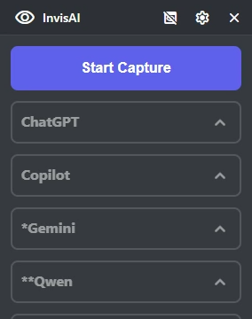
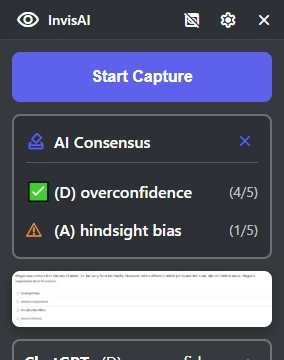
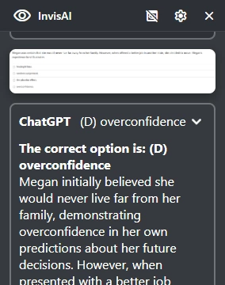
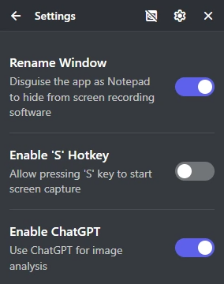
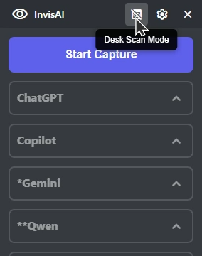
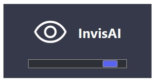
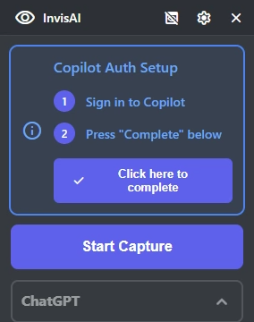
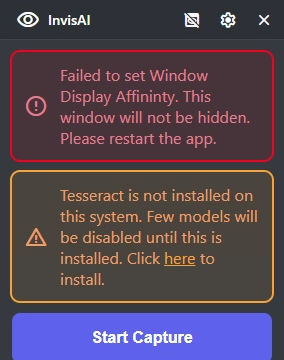

# InvisAI: AI your screen, *secretly*
> [!CAUTION]
> Disclaimer: The creator is not responsible for any consequences or actions taken by users, including if you are caught using this tool.
> I do not condone cheating, and this app was made for educational purposes only. 

A Windows application for *secretly* plugging anything into AI. The app is **hidden from all screen capture** using Windows APIs. This app also is **invisible to focus change detectors**!
**Built as an alternative and a jab at Cluely, a closed-source software that makes people pay!!**

## Evade Proctorio with *style*
All the features in this app make it perfect to be undetectable to Proctorio!

## Features
- 🔒 **Screen Capture Protection** - Hidden from screen capture software
- 💻 **Focus Change Prevention** - Doesn't show up in any focus change detectors
- 👩‍💻 **Window Cloaking** - Disguise your window as Notepad 
- 🎯 **Area Selection** - Click two corners to select any screen area
- 🌐 **Modern UI** - Beautiful HTML/CSS/JS interface
- 🤖 **Multiple AI Checking** - Double check all your answers with so many different AI models!
  - ChatGPT
  - Microsoft Copilot
  - *Gemini
  - **Qwen
  - **DeepSeek
- ⌨ **Hotkey Support** - Activate the screen capture through a simple hotkey!
- 📷 **Desk Scan Mode** - Temporarily hide your window for any desk scan!
- 📰 **AI Consensus** - Get a preview of what all AIs say in one single glance!

## Screenshots
> [!NOTE]
> These screenshots taken with by temporarily disabling the hidden feature; in reality it is impossible to screenshot the app. 

### Copilot Auth Setup

### Other Warnings

## How to Use
1. Launch InvisAI.exe
   - If Windows tells you "this app has been blocked", then press "More" and "Run Anyway"
2. Complete the warning notices. 
    - To work, Gemini needs to be signed in on one of your browsers, prefferebly Microsoft Edge. Your browser must also be closed when running the first AI Capture. 
    - Microsoft Copilot requires you to have a `.har` file saved to `har_and_cookies`. You can does this manually, or follow the instructions on the app to sign-in and automatically grab the `.har` file. 
    - To use Qwen and DeepSeek, Tesseract must be installed. 
3. Press **Start Capture** or press **S**
4. Left click on both your corners of the question. 
5. Wait for the AIs to complete and give you an answer!
    > [!IMPORTANT]
    > Note: Qwen AI and DeepSeek AI don't have a direct image AI function, so InvisAI reads the text in the image and plugs in that. Because of this, these AIs don't support image/stimulus based questions. 

## Building from source
1. Make sure you have Python and Git installed
2. Clone this repo with `git clone https://github.com/ruskcoder/InvisAI` (or download as .zip)
3. CD into your directory: `cd ../../InvisAI`
4. Create a virtual environment with `python -m venv venv`
5. Activate the virtual environment: 
   - On PowerShell, run: `venv/Scripts/activate.ps1`
   - On Command Prompt, run `venv\Scripts\activate.bat`
6. Install requirements: `pip install -r requirements.txt`
7. Build! (make sure venv is activated)
  - On PowerShell: `.\build.ps1`
  - On Command Prompt: `build.bat`
8. Find your built files in `/dist/InvisAI.exe`
